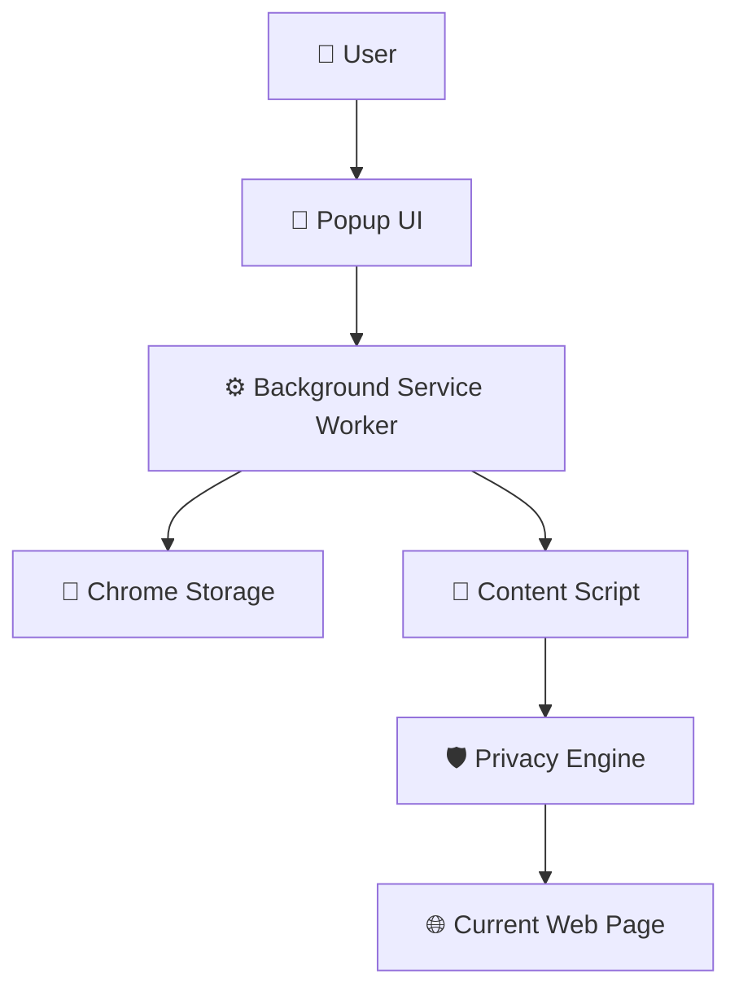
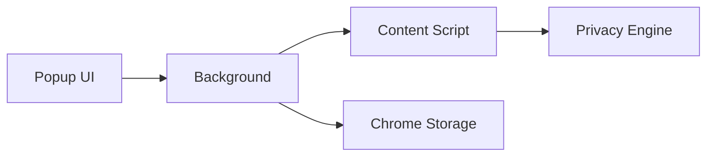
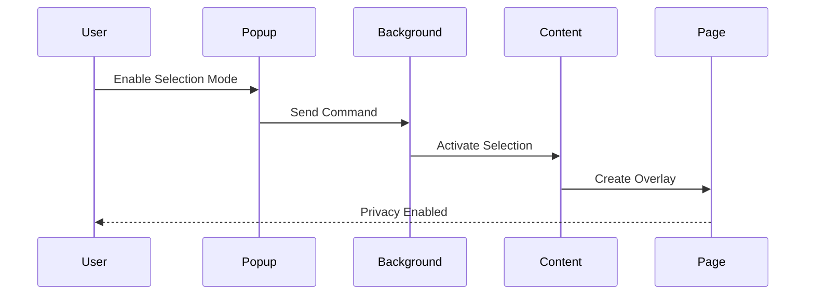
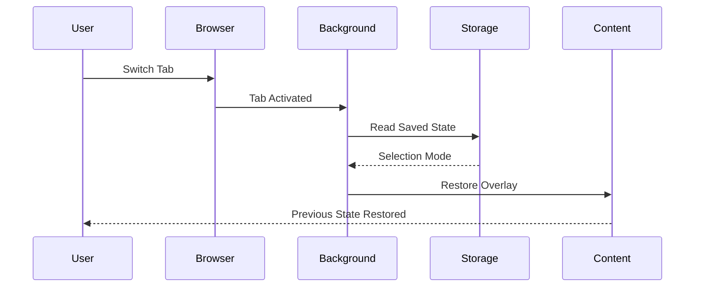
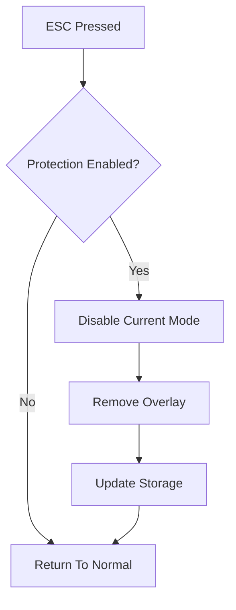
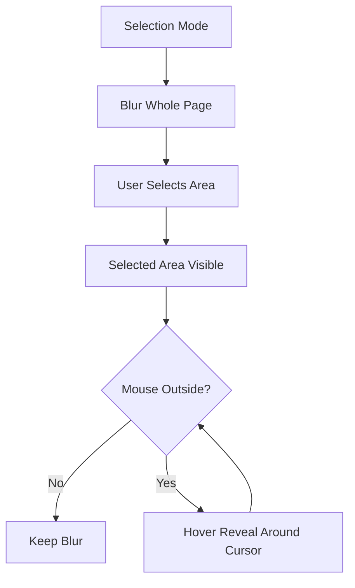
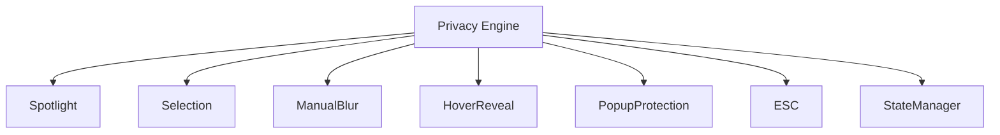
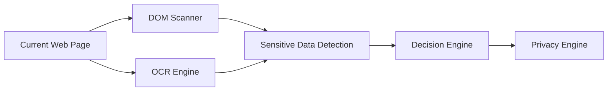
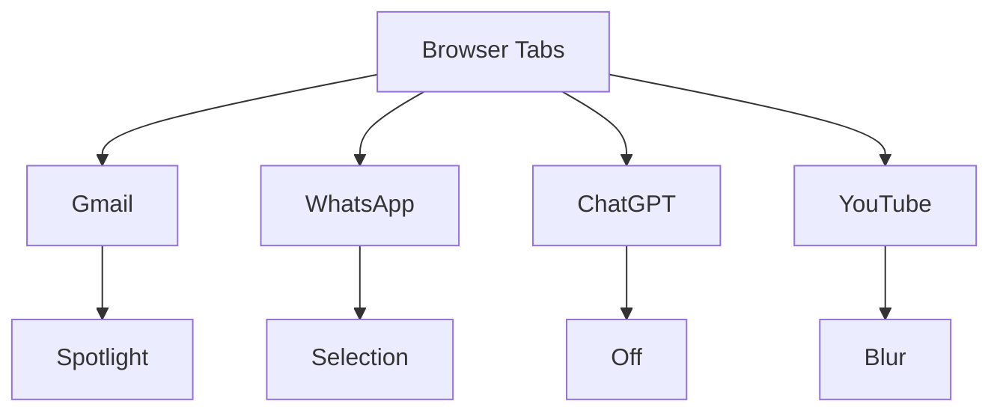

# 🏛️ PrivateView Architecture

## High Level Architecture



---

# Extension Components



---

# Message Flow



---

# State Restoration



---

# ESC Flow



---

# Selection Mode



---

# Privacy Engine



---

# Current Features

```mermaid
mindmap

root((PrivateView))

Spotlight

Selection

Hover Reveal

Blur Strength

Spotlight Radius

Popup Protection

ESC Exit

Tab Persistence

Reload Persistence

Alt+Tab Persistence

Settings

Future AI
```

---

# Future AI Architecture



---

# Tab State Management



---

# Folder Structure

```text
PrivateView

│

├── popup/

│   ├── popup.html

│   ├── popup.css

│   └── popup.js

│

├── background/

│   └── service-worker.js

│

├── content/

│   ├── content.js

│   ├── overlay.js

│   ├── selection.js

│   ├── spotlight.js

│   └── hoverReveal.js

│

├── assets/

│

├── manifest.json

│

├── README.md

└── Architecture.md
```

---

# Design Principles

- 🔒 Privacy First

- ⚡ Fast Rendering

- 🧠 Minimal User Interaction

- 🪶 Lightweight

- 🧩 Modular

- ♻️ Maintainable

- 🚀 Easy To Extend

---

# Roadmap

- AI Sensitive Content Detection

- OCR Engine

- Password Detection

- Credit Card Detection

- Screen Sharing Mode

- Meeting Mode

- Privacy Profiles

- Smart Recommendations

- Website Rules

- Multi Browser Support
# Engineering Challenges

## Challenge 1

### Problem

Selection Mode made navigation difficult because users could not interact with hidden UI elements.

### Solution

Implemented Hover Reveal that temporarily creates a spotlight around the cursor when navigating outside the selected region.

---

## Challenge 2

### Problem

Protection was lost after switching tabs using Alt + Tab.

### Solution

Implemented automatic state restoration to preserve the active privacy mode.

---

## Challenge 3

### Problem

Each browser tab required independent privacy behavior.

### Solution

Designed a per-tab state management system that restores the correct mode whenever a tab becomes active.

---

## Challenge 4

### Problem

Users needed a fast way to disable privacy protection.

### Solution

Implemented a global ESC shortcut that immediately exits the current protection mode.